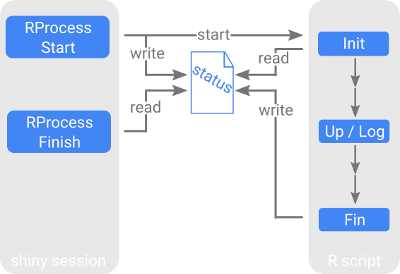

# Contents

1. [Single R batch script](#single)  
2. [Multiple scripts](#multi)  


```{r setup, echo=FALSE, results="hide"}
knitr::opts_chunk$set(echo = TRUE, fig.width = 7, fig.height = 7)
```

<br/><br/>


# Single R batch script<a name="single"></a>

## Simple Example <a name="single1"></a>

Have a file `process.R` in the current working directory which looks like this:

```{r, eval=FALSE}
# read input and info about process, report to app that it started
input <- shinyTools::Rscript_Init(commandArgs(TRUE))

# do stuff
Sys.sleep(4)
res <- shinyTools::Rscript_Try(dpois(1:100, input))

# finish return result to shiny session
shinyTools::Rscript_Fin(res)
```

Then, start an app like this:

```{r, eval=FALSE}
library(shinyTools)

ui <- fluidPage(sidebarLayout(
  sidebarPanel(
    h2("Distribution"),
    numericInput("num1", "set lambda", 10, -10, 50),
    RProcessUI("process"),
    actionButton("trigger", "Start"),
    helpText("Poisson distribution is created in R batch script with a few seconds delay.")
  ),
  mainPanel(
    h3("Poisson Distribution"),
    plotOutput("plot")
  )
))

server <-function(input, output, session) {
  result <- callModule(RProcess, "process", trigger = reactive(input$trigger), object = reactive(input$num1), script = "./process.R")
  output$plot <- renderPlot(if(is.null(result()$result)) NULL else plot(1:100, result()$result))
}

shinyApp(ui, server)
```

## How it works

The shiny session is running the R batch script via a `system2` call to `Rscript`.
For the communication between the app and this R script a text file will be written.
`RProcess` will watch this file, thus can react to updates from the R script.
This text file contains some information the working directories, possible log files and the id of the process.
It is named after the process id suffixed with `-ifof.status`.
The actual input for the R script is given via another file which will have the process id suffixed with `-ifof.rds` as name.
When the R script has finished this file is overwritten to hand over the output to the shiny session.



#### Functions for the R Script

At the beginning, the R script must read the status file. This should be done with the function `Rscript_Init`.
It will create an object `info` in the global environment.
This object contains the information of the status file and it will be used by other `RProcess` functions.
For writing a log or sending a status update (like 40\% or so) to the shiny session functions `Rscript_Log` and `Rscript_Up` can be used.
At the very end of the R script, the `Rscript_Fin` function should be used which signals the shiny session that the R script has finished.
All the outputs are written and the R session is quit.
There is also a function -- `Rscript_Try` -- which can be used for stuff that might produce an error.
If the R script runs into an error and quits the shiny session will never know about it.
`Rscript_Try` just makes sure that the shiny session is informed about that with some kind of error message.
See the documentation for further details on these functions.

Note that there is a process id which is generated when starting a process with `RProcess`.
It has the effect that if a process is started a second time before the first process has finished, the older process will quit.
The functions `Rscript_Init`, `Rscript_Log`, `Rscript_Up`, `Rscript_Try`, `Rscript_Fin` all check whether they are still the *newest* process before they write anything.

#### Directories and Logs

If you read the documentation for `RProcess` you will see that there can be several directories.
Basically, the R script can be in any directory (argument `script`), the process will always run in the directory defined as `pwd`.
The R script will set its working directory to `pwd` with the call to `Rscript_Init`.
This is also where the `.status` and `.rds` files are read and written.

There is the option to write log files by defining a file with `logFile`.
If this is set some logs are written by default, e.g. starting and finishing the R script.
Otherwise use the `Rscript_Log` function to write something in there.
If you have several users you might want to use the argument `sessionid` which will give every log entry a prefix.
This way you can distinguish different sessions in the log file later on.

## Starting and polling Process seperately <a name="single2"></a>

To show the mechanics we now start and poll the process seperately. 
`RProcess` is just a convenience function which does both at once.
It calls `RProcessStart`, which can do a quality check and then start the R script, and `RProcessFinish`, which looks at the status file and reacts to it if it changes.
Here, we also make use of different directories, a check function, log files and a session ID.

To run the script create subdirectories `./tmp`, `./log`, `./scripts` in the current directory.
The R script will be in `./scripts`. 
It is called `process.R` and looks like this:

```{r, eval = FALSE}
# process.R
input <- shinyTools::Rscript_Init(commandArgs(TRUE))

shinyTools::Rscript_Log(c("Input is", input))
Sys.sleep(2)

if(input > 100) shinyTools::Rscript_Abort("Input greater 100")

info <- shinyTools::Rscript_Up(0.8)

Sys.sleep(4)
res <- shinyTools::Rscript_Try(dpois(1:100, input))

shinyTools::Rscript_Fin(res)
```

The function `Rscript_Abort` terminates the R script and sends its argument as an error message to the shiny session.
This can be used to do quality checks in the R script.
The app below is started from the current directory.

```{r, eval=FALSE}
library(shinyTools)

check <- function(object, add){ if(object <= add$n) return(paste("Lambda must be greater", add$n, "idiot!"))}

ui <- fluidPage(sidebarLayout(
  sidebarPanel(
    h2("Distribution"),
    numericInput("num1", "set lambda", 10, -10, 50),
    RProcessStartUI("process"),
    actionButton("trigger", "Start"),
    helpText("Poisson distribution is created in R batch script with a few seconds delay."),
    br(),
    actionButton("num2", "check responsiveness"),
    verbatimTextOutput("num2"),
    helpText("By clicking on the button you can see that the app is still responsive while running the R batch script.")
  ),
  mainPanel(
    h3("Poisson Distribution"), 
    RProcessFinishUI("process"), 
    plotOutput("plot"), 
    h3("Return value of RProcessFinish"),
    verbatimTextOutput("result")
  )
))

server <-function(input, output, session) {
  callModule(RProcessStart, "process", trigger = reactive(input$trigger), object = reactive(input$num1),
             script = "./scripts/process.R", logFile = "log/log.log", pwd = "./tmp", sessionid = "asd",
             checkFun = "check", addArgs = list(n = 0))
  result <- callModule(RProcessFinish, "process", pwd = "./tmp")
  output$plot <- renderPlot(if(is.null(result()$result)) NULL else plot(1:100, result()$result))
  output$result <- renderPrint(result())
  output$num2 <- renderPrint(input$num2)
}

shinyApp(ui, server)
```

`RProcessStart` and `RProcessFinish` must both be called with the same id, so that `RProcessFinish` will look for the correct `.status` and `.rds` files.
You can provoke the check function by using a lambda smaller 0 or force the script to stop with an error by using a labmda greater 100.
The error messages are displayed in two different locations (sidebarPanel, mainPanel).
If `RProcess` is used they are both in the same place.

<br/><br/>

# Multiple scripts<a name="multi"></a>

By using `RProcessStart` and `RProcessFinish` explicitly one can chain several processes together.
This might be useful if a process takes very long but some partial results should already be send to the shiny session.
This way the user can already check out partial results while the process is still running.

To run the script create subdirectories `./tmp`, `./log`, `./scripts` in the current directory.
Now, there are two R scripts in `./scripts` called `process1.R` and `process2.R`.
Process 1 will start process 2 using the `Rscript_Start` function.

```{r, eval=FALSE}
# process1.R
input <- shinyTools::Rscript_Init(commandArgs(TRUE))
Sys.sleep(4)
res <- shinyTools::Rscript_Try(dpois(1:100, input))
shinyTools::Rscript_Start("process2", "/absolute/path/to/scripts/process2.R",
      logFile = "/absolute/path/to/log/log2.log")
shinyTools::Rscript_Fin(res)
```

**Process 1** is started with id `process1` and its results can be retrieved using this id.
But before finishing with the `Rscript_Fin` function process 1 starts another R script using id `process2`.
Note, script and log path must be given absolute or relative from the working directory of `process1`.

```{r, eval=FALSE}
# process2.R
input <- shinyTools::Rscript_Init(commandArgs(TRUE))
Sys.sleep(4)
res <- shinyTools::Rscript_Try(dnorm(1:100, input, 10))
shinyTools::Rscript_Fin(res)
```

**Process 2** is then running with id `process2` and its results can be retrieved using this id.
The shiny session would look like this.

```{r, eval=FALSE}
library(shinyTools)

check <- function(object, add){ if(object <= add$n) return(paste("Lambda must be greater", add$n, "idiot!"))}

ui <- fluidPage(sidebarLayout(
  sidebarPanel(
    h2("Distributions"),
    numericInput("num1", "set lambda", 10, -10, 50),
    RProcessStartUI("process1"),
    actionButton("trigger", "Start"),
    helpText("Poisson distribution is created in a first R batch script which takes a few seconds.
             Before this script finishes a second R batch script is started by the first one.
             This calculates a normal distribution with lambda as mean.")
  ),
  mainPanel(
    h3("Poisson Distribution"),
    RProcessFinishUI("process1"),
    plotOutput("plot1"),
    h3("Normal Distribution"),
    RProcessFinishUI("process2"),
    plotOutput("plot2")
  )
))

server <-function(input, output, session) {
  callModule(RProcessStart, "process1", trigger = reactive(input$trigger), object = reactive(input$num1),
             script = "./scripts/process1.R", logFile = "log/log1.log", pwd = "./tmp", sessionid = "asd",
             checkFun = "check", addArgs = list(n = 0))
  result1 <- callModule(RProcessFinish, "process1", pwd = "./tmp")
  result2 <- callModule(RProcessFinish, "process2", pwd = "./tmp")
  output$plot1 <- renderPlot(if(is.null(result1()$result)) NULL else plot(1:100, result1()$result))
  output$plot2 <- renderPlot(if(is.null(result2()$result)) NULL else plot(1:100, result2()$result))
}

shinyApp(ui, server)
```

R script `process1.R` is started from the app and the results are retrieved in the app using id `process1`.
R script `process2.R` is started by `process1.R` and the results are retrieved in the app using id `process2`.


